<center><h1>区块链大作业实验报告</h1></center>

任课教师：郑子彬

|   年级   |   学号   |       电话        |   开始日期   |
| :------: | :------: | :---------------: | :----------: |
|  2017级  | 17343122 |    15626169266    |  2019-12-1   |
| **专业** | **姓名** |     **Email**     | **完成日期** |
| 软件工程 |  吴毓婷  | 2055718105@qq.com |  2019-12-13  |

[github地址](https://github.com/LeoBarwoo/BlockChain)

[视频地址](https://www.bilibili.com/video/av79131015/)

## 一、项目背景

供应链中的交易和应收账款单据需引入第三方可信机构 (例如银行，物流公司) 来确认这些交易，确保交易和单据的真实性。同时，应收账款可能会被转让， 融资，清算等，让核心企业的信用可以传递到供应链的下游企业，减小中小企业的融资难度。


## 二、方案设计

* 后端&前端使用 express + ejs 实现。
* 前端使用了模板。

### 存储设计

* 数据结构和映射来保存。

* **User**

  ```c++
  struct User {
    uint 	balance;
    uint 	bill;
    uint 	reputation;		// true->good, false->bad
    string  password;
    Bill [] bills;
    bool isValid;
  }
  ```

  * balance ：企业/公司余额；
  * bill ：企业/公司未偿还的融资金额；
  * reputation：企业/公司的信誉；
  * bills：企业/公司的账单；

* **Bill**

  ```c++
  /* 企业未支付的账单 */
  struct Bill {
    int status;
    address to;
    uint 	amount;
    uint 	latestTime;
  }
  ```

  * status：表示该账单是否已经融资，0 未融资，1 已融资；
  * to：该帐单应该支付给谁；
  * amount：账单收款金额；
  * latestTime：账单创建时间戳；

* 映射

  ```C++
  mapping (address => User) public users;
  ```

  * 通过 `users` 可以直接查看企业基本信息。


### 核心功能介绍

#### 交易事件

```c++
event CreateBill(uint time, address from, address to, uint amount);
event TransferBill(uint time, address from, address mid, address to, uint amount);
event RequestFinancing(address from, uint amount);
event SettleBill(uint time, address from, address to, uint amount);
event Log(uint index, Bill bill);
```

#### 用户登录

```C++
function Signin(address userAddr, string password) public view returns(bool pass, uint balance, uint bill, uint reputation) {
  if (users[userAddr].isValid && keccak256(users[userAddr].password) == keccak256(password)) {
    return (true, users[userAddr].balance, users[userAddr].bill, users[userAddr].reputation);
  }
  return (false, 0, 0, 0);
}
```

* 使用企业地址创建从地址到 `User` 的映射；
* 初始企业余额为 0，未偿还融资金额为 0，信誉为好。

#### 用户注册

```c++
function SignUp(address newUser, string newKey) public returns(bool pass) {
  if (users[newUser].isValid) {
    return false;
  }
  users[newUser].balance = 0;
  users[newUser].bill = 0;
  users[newUser].reputation = 1;
  users[newUser].isValid = true;
  users[newUser].password = newKey;
  return true;
}
```

#### 银行向企业/公司发放资产

```C++
function issue(address iss, address receiver, uint amount) public {
  if (iss != issuer && receiver == issuer) return;
  users[receiver].balance += amount;
}
```

* 银行向 `receiver` 发放金额为 `amount` 的资产，该函数的调用者必须是银行。

#### 创建应收账款

* 这里为了方便，建立的是应付账单，存在付款方的账户里，也就是 `User` 中的 `bills`。
* 当付款方的信誉高于收款方的信誉，简单提高收款方的信誉，实现信誉传递。

```c++
function createBill(address payer, address payee, uint amount) public returns (uint, address, address, uint) {
  uint time = now;
  uint len = users[payer].bills.length;
  (users[payer].bills.length)++;
  users[payer].bills[len] = (Bill(0, payee, amount, time));
  if (users[payer].reputation > users[payee].reputation)
    users[payee].reputation = users[payer].reputation;

  emit CreateBill(time, payer, payee, amount);
  return (time, payer, payee, amount);
}
```

#### 查看某个企业的账单

```c++
function getBill(address querier, address ones) public {
  for (uint i = 0; i < users[ones].bills.length; ++i) {
    emit Log(i, users[ones].bills[i]);
  }
}
```

* 通过企业地址获取该企业的应付账单。

#### 账单转让

```C++
function transferBill(uint time, address mid, address payee) public {...}
```

* 如果 `mid` 企业应付账给该企业，该企业应付款给 `payee` 企业，则该企业可以将自己应付给 `payee` 的账款，转让到 `mid` 账户，使 `mid` 应付帐给 `payee`。
* 整个实现的逻辑如下
  * 首先通过 `time` 找到该企业到 `payee` 的应付账款金额 $m_i$；
  * 然后在需要转移的 `mid` 企业应付账款中找到所有到该企业的应付账款 $m_j$
    * 如果 $m_j =< m_i$ ，说明该企业到 `payee` 的剩余应付账款金额目前不能完全转移到 `mid` 头上，则$m_i = m_i - m_j$ ，并将 $m_j$ 对应的 `mid` 到该企业的应付账款删除，但还可以继续查找下一个 $m_j$。
    * 如果 `m_j >= m_i` ，说明该企业到 `payee` 的剩余应付账款金额可以完全转到 `mid` 头上。
  * 搜索完 `mid` 企业的账单后，向 `mid` 企业添加从 `mid` 到当前企业的应付账款减少的金额，作为从 `mid` 到 `payee` 的应付账款。如果 $m_i <= 0$ ，说明该应付账款已完全转移到 `mid` 头上，则还需从该账户的应付账款中删掉 `time` 对应的到 `payee` 的账款。  

#### 向银行申请融资

- 应收账款的付款企业/公司的信誉必须为好才能向银行申请融资；
- 针对某个应收账款申请的融资金额不能超过该账款的金额。

```C++
function requestFinancing(address payer, address payee, uint time, uint amount) public returns (bool, uint) {
  if (payee == issuer || users[payer].reputation == 0) return;
  uint len = users[payer].bills.length;
  for (uint i = 0; i < len; ++i) {
    if (users[payer].bills[i].latestTime == time) {
      if (users[payer].bills[i].to == payee
          && users[payer].bills[i].amount >= amount
          && users[payer].bills[i].status == 0) {
        users[payer].bills[i].status = 1;
        users[payee].balance += amount;
        users[payee].bill += amount;
        emit RequestFinancing(payee, amount);
      }
      return (true, amount);
    }
  }
  return (false, 0);		
}
```

#### 支付账单

* 只有当该企业的余额不小于当前应付账款金额使才能支付该账单；
* 将收款方的金额增加 `amount` ，将该企业的余额减少 `amount`。
* 从该企业的应付账款中删掉该账单。

```c++
function settleBill(address payer, uint time) public returns(uint) {
  uint len = users[payer].bills.length;
  uint amount;
  address payee;
  for(uint i = 0; i < len; ++i) {
    if (users[payer].bills[i].latestTime == time) {
      amount = users[payer].bills[i].amount;
      if (amount <= 0 || amount > users[payer].balance) {return 0;}
      payee = users[payer].bills[i].to;
      users[users[payer].bills[i].to].balance += amount;
      users[payer].balance -= amount;

      if (len > 1) {
        users[payer].bills[i] = users[payer].bills[len - 1];
      }
      delete users[payer].bills[len - 1];
      if (users[payer].bills.length > 0) {
        (users[payer].bills.length)--;
      }

      emit SettleBill(time, payer, payee, amount);
      return amount;
    }
  }
  return 0;
}
```

#### 后端

* 比如 signin

```javascript
app.get('/signin',function(req,res) {
  req.session.username = '';
  console.log('get signin');
  res.render(path.join(__dirname, "/views/login"),{
    method1: '<button type = "submit" class="btn btn-greensea">Log In</button>',
    method2: '<a href="/signup"><label class="btn btn-slategray">Create an account</label></a>',
    message: mes
  });
  mes = '';
})
```

```javascript
app.post('/signin', urlencodedParser, function (req, res) {
  console.log("login...");
  console.log("req.body:", req.body);
  let functionName = "Signin";
  let parameters = [req.body.username, req.body.password];
  if (parameters[0] == '' || parameters[1] == '') {
    res.redirect('/signin');
    return;
  }
  else {
    call(functionName, parameters).then(result => {
      console.log("result:", result);
      if (result.output.pass) {
        //res.status(302);
        data = {
          address: req.body.username,
          balance: result.output.balance,
          bill: result.output.bill,
          reputation: result.output.reputation 
        }
        req.session.username = data.address;
        res.redirect('/home');
      }
      else {
        mes = '<div>Invalid username or password</div>'
        res.redirect('/signin');
      }
    });
  }
})
```

#### 前端

* 使用 ejs 模板引擎

```ejs
<form id="form-signin" class="form-signin" method="post">
  <section>
    <div class="input-group field">
      <input type="text" class="form-control" name="username" placeholder="Username">
      <div class="input-group-addon"><i class="fa fa-user"></i></div>
    </div>
    <div class="input-group field">
      <input type="password" class="form-control" name="password" placeholder="Password">
      <div class="input-group-addon"><i class="fa fa-key"></i></div>
    </div>
  </section>
  <section class="log-in">
    <%- method1%>
    <span>or</span>
    <%- method2%>
  </section>
</form>
<%- message%>
```


## 三、功能测试

* 合约地址

```
0xdb030e6a567d19b1a06de3f6e08223be082d009d
```

* 用户A地址

```
0x284ebe31c0a348d3163328296f60d1c8da98bebd
```

* 用户B地址

```
0x2603b181d4dce1505dc98ad77af7d058ffd43a5e
```

* 用户C地址

```
0xa68cb918bc71e7846e33f34c3cf02f0f85968de5
```

**设置供应链所有者**

* 后端操作，这里供应链所有者类似于银行

```
./cli.js call Finorm 0xdb030e6a567d19b1a06de3f6e08223be082d009d setIssuer 0x507f4b5a44cfce9ac6f876e71d3a904bf84d7207
```

**登陆**

* 输入非法的用户或密码显示

<left>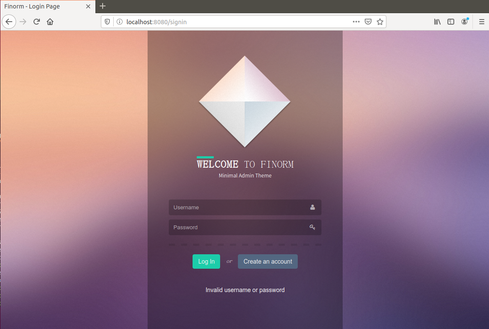</left>

* 输入正确的用户或密码，跳转到主页

<left>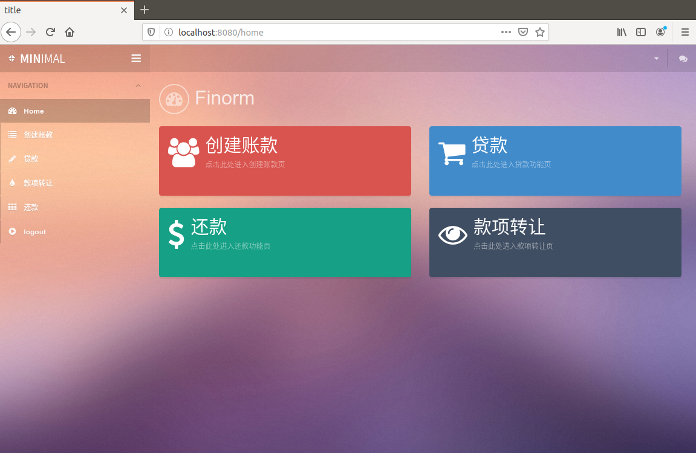</left>

* 跳转到注册页面

<left>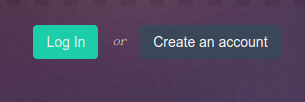</left>

**注册**

* 成功注册显示

<left>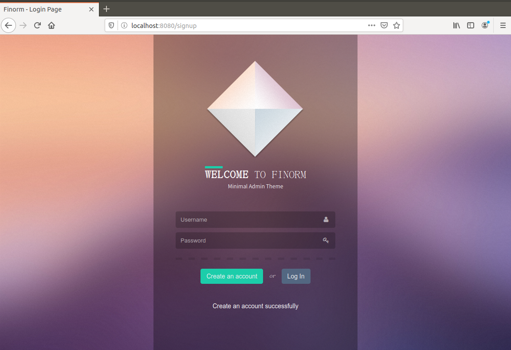</left>

* 注册已存在的用户

<left>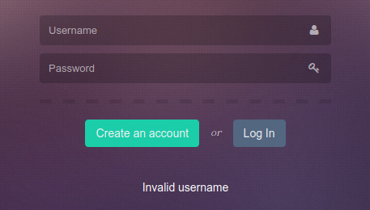</left>

* 跳转到登录页面

<left>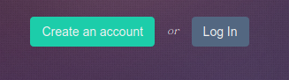</left>

**主界面**

* 成功登陆后跳转到主页

<left></left>

* 点击四个选项块，进入不同的交易界面

<left>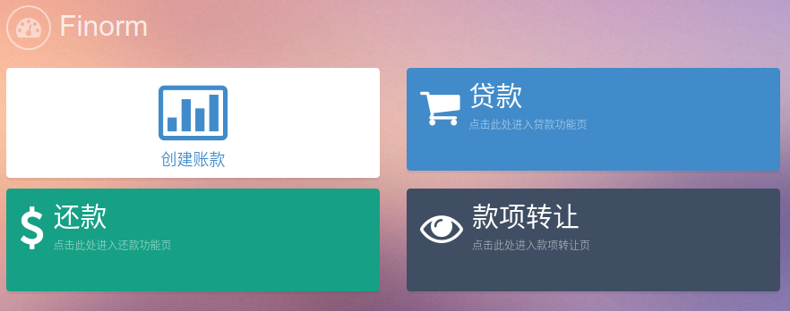</left>

**创建账单**

* 利用 session 自动填写好收款人，也就是只有收款人本人能创建账单，其他用户无法为该用户创建

<left>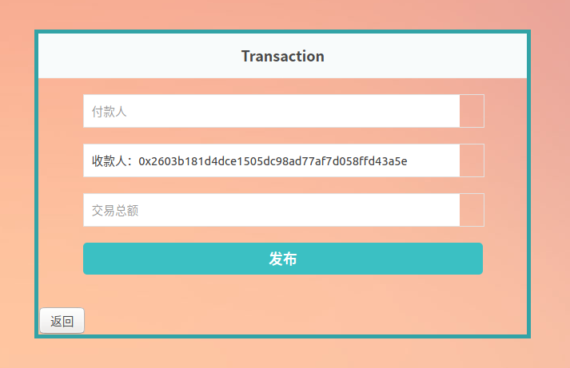</left>

* 填写好账单

<left>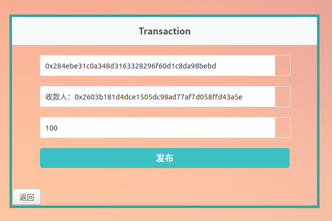</left>

* 发布后的返回信息

<left>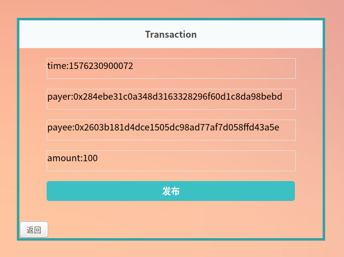</left>

* 左下角可以返回主页

**账款转让**

11-13

* 使用 session ，原付款人为当前用户，不可更改

<left>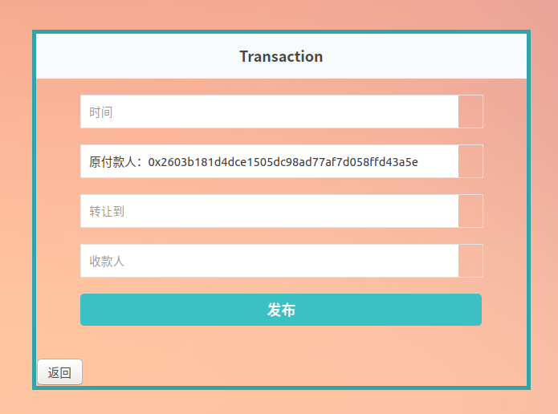</left>

* 填写好要转让的账款的时间戳，转让到的用户，和收款人，然后发布

<left>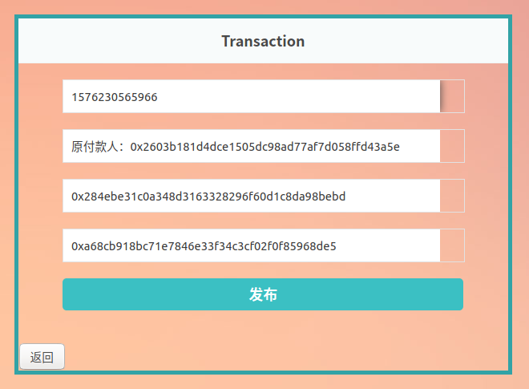</left>

* 完成转让

<left>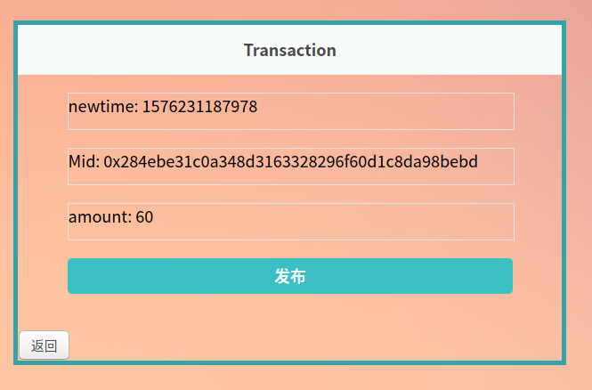</left>

**向银行申请融资-贷款**

* 使用 session，申请人(账单收款人)的为当前用户，不可更改

<left>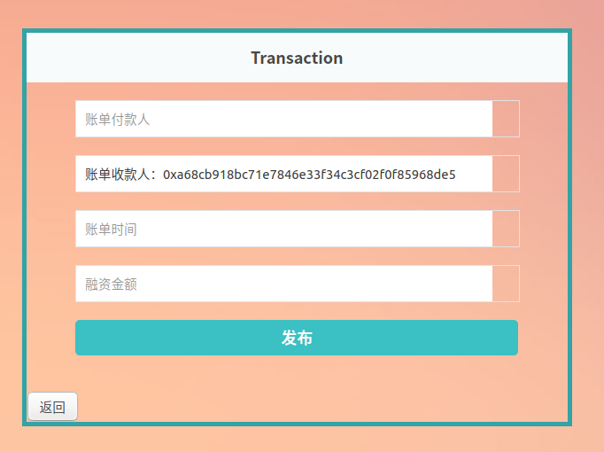</left>

* 填写账单的付款人和时间戳，确定能否融资，融资金额需小于该账单的金额

<left>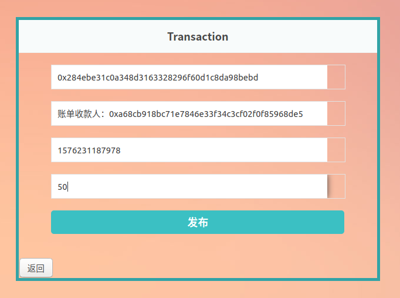</left>

* 融资成功

<left>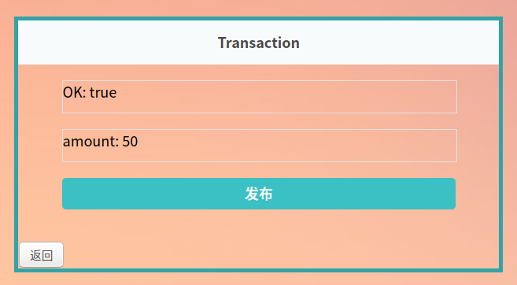</left>

**银行从后端给 A 发放资金**

```
./cli.js call Finorm 0xdb030e6a567d19b1a06de3f6e08223be082d009d issue 0x507f4b5a44cfce9ac6f876e71d3a904bf84d7207 0x284ebe31c0a348d3163328296f60d1c8da98bebd 120
```

<left>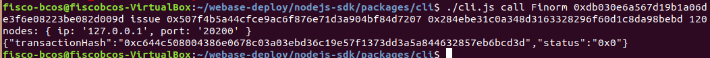</left>

**还款**

* 使用 session，还款人为该登陆用户

<left>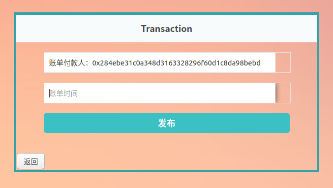</left>

* 还款成功

<left>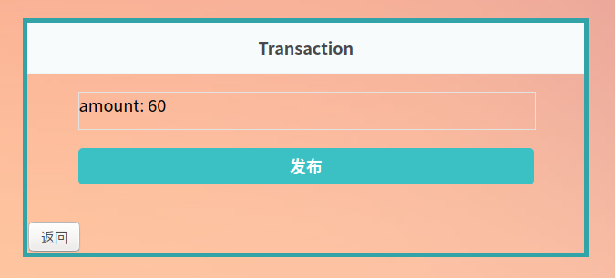</left>


## 四、界面展示

* 上述测试已经展示了大部分界面，另外可以看视频演示
* 以下是一些额外说明

* 左边导航栏下边是基本信息，上边也能跳转进入各个功能区

<left>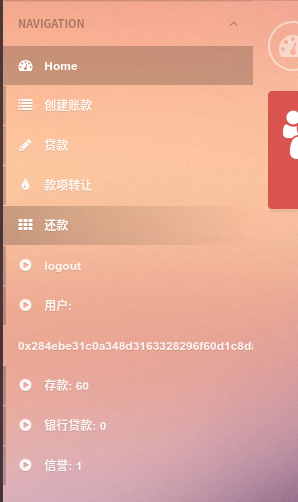</left>

* 右上角能更换主题颜色以及退出

<left>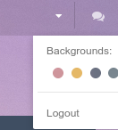</left>


## 五、心得体会

本次前端，后端和链段的实现过程比较艰辛。链段虽然之前实现了，但这次需要根据后端的实现进一步调整，后端开始也无从下手，后面认真看了webase提供的 nodejs-sdk 中的包的实现代码，逐渐有了方向。前端虽然以前学过 Web 前端课程，但平时没怎么用，所以有点生疏了。另外虽然本次作业的基本功能都完成了，但整个demo的功能还非常不完整，并且目前没有太完整的异常处理功能。在整个过程中，有很多收获，也解决了很多 bug，对自己的能力是一次很好的提升。